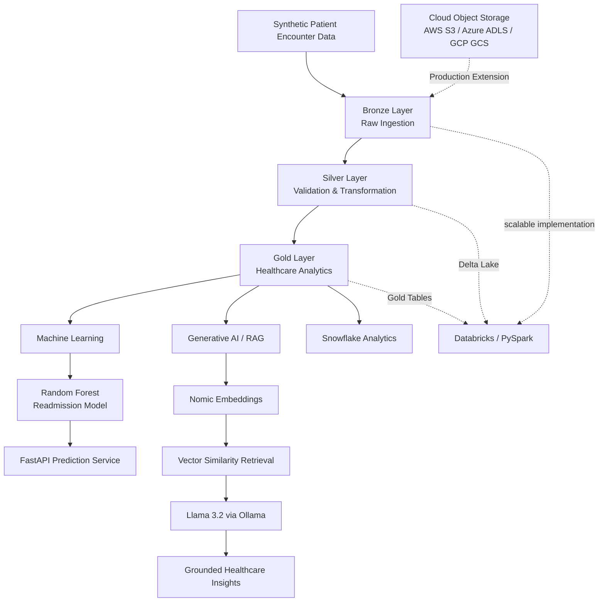

# Intelligent Healthcare Data & AI Platform — Architecture

## Data Flow

**Synthetic Patient Data → Bronze → Silver → Gold → ML / RAG / Analytics**

- **Bronze:** Raw healthcare encounter ingestion
- **Silver:** Data validation, cleaning and feature engineering
- **Gold:** Aggregated healthcare analytics and readmission KPIs
- **ML:** Random Forest model for 30-day readmission prediction
- **API:** FastAPI exposes real-time prediction endpoints
- **GenAI/RAG:** Embeddings + semantic retrieval + local Llama 3.2
- **Databricks:** PySpark/Delta Lake implementation for scalable processing
- **Snowflake:** Analytical warehouse SQL implementation
- **Cloud:** AWS, Azure and GCP-ready storage architecture

> All patient data used by this project is synthetically generated.
